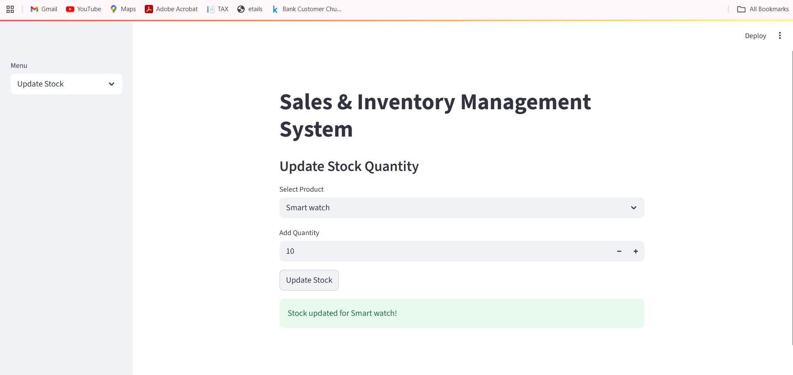

# 📦 Sales & Inventory Management System

A **Streamlit + SQLite** web application to manage products, track sales, update stock, and visualize inventory with an interactive dashboard.  
Built with simplicity in mind — no complex database setup required!

---

## ✨ Features
- **Add Products** with name, price, and initial stock.
- **Update Stock** quantities easily.
- **Record Sales** with automatic stock deduction.
- **View Inventory** in tabular format.
- **View Sales Records** with product details.
- **Dashboard** with:
  - Inventory stock level bar chart.
  - Sales over time line chart.
- **Lavender UI Theme** for a clean and modern look.

---

## 🛠 Tech Stack
- **Python 3.13**
- **Streamlit** – Web UI
- **SQLite** – Lightweight database
- **Matplotlib** – Data visualization
- **Pandas** – Data processing

---
## 📂 Project Structure
```plaintext
.
├── app.py              # Main Streamlit application
├── database.py         # Database creation & setup
├── sales_inventory.db  # SQLite database
├── Dockerfile          # Docker configuration
├── requirements.txt    # Dependencies
├── screenshots/        # App screenshots
└── .gitignore

## 📸 Screenshots

### Dashboard
.png)

### Add Product


### Update Stock


### Record Sale


---

## ⚙️ Installation & Running

### 1️⃣ Clone the Repository
```bash
git clone https://github.com/<your-username>/<repo-name>.git
cd <repo-name>


### 2️⃣ Create Virtual Environment (Optional but recommended)
python -m venv env
source env/bin/activate      # Linux/Mac
env\Scripts\activate         # Windows

3️⃣ Install Dependencies
pip install -r requirements.txt

4️⃣ Initialize Database
python database.py

5️⃣ Run the Application
streamlit run app.py


🐳 Running with Docker
# Build the image
docker build -t sales_inventory_app .

# Run the container
docker run -p 8501:8501 sales_inventory_app


📜 License
This project is licensed under the MIT License – see the LICENSE file for details.

🤝 Contributing
Pull requests are welcome! For major changes, please open an issue first to discuss what you’d like to change.

📧 Contact
For any questions or suggestions:
Your Name – nivethatk03@gmail.com

---

